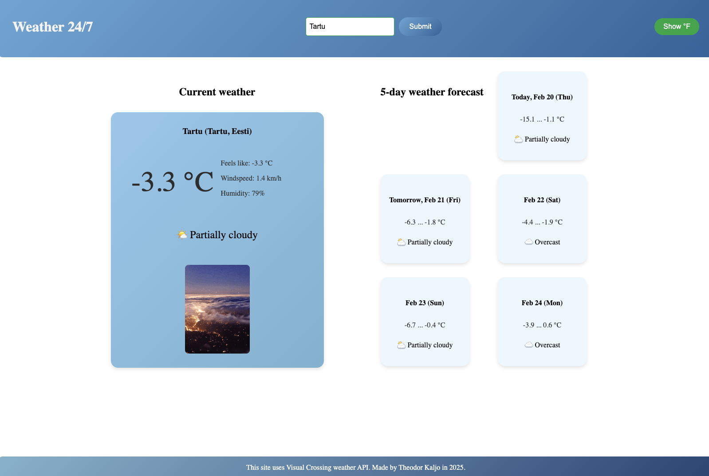

# Weather App

This is a simple weather application that displays the current weather and a 5-day forecast for a given location. It also includes a fun GIF related to the current weather condition, fetched from the Giphy API.

## Features

* **Current Weather:** Displays the current temperature (in Celsius or Fahrenheit), feels-like temperature, weather condition, and a corresponding emoji.
* **5-Day Forecast:** Shows the minimum and maximum temperatures for the next 5 days, along with weather conditions and emojis.
* **Location Search:** Allows users to enter a location to get weather information.
* **Celsius/Fahrenheit Toggle:** Users can switch between Celsius and Fahrenheit temperature units.
* **Weather-related GIF:** Displays a GIF related to the current weather condition, making the experience more engaging.

## Technologies Used

* HTML
* CSS
* JavaScript
* Date-fns library for date formatting
* Visual Crossing Weather API
* Giphy API

## Acknowledgements

* [Visual Crossing Weather API](https://www.visualcrossing.com/weather-api)
* [Giphy API](https://developers.giphy.com/)
* [Date-fns](https://date-fns.org/)

## License

MIT License